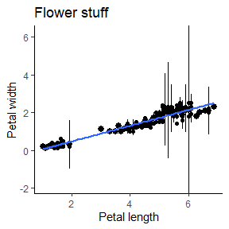
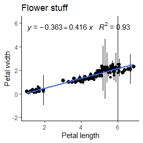

```{r, include = FALSE}
knitr::opts_chunk$set(
  collapse = TRUE,
  comment = "#>"
)

library(dplyr)

```


### Common libraries:

```{r, eval = FALSE}

library(dplyr)
library(magrittr)
library(tidyr)
	
```


Snippet would look like:
```{r, eval=FALSE}
snippet tidyverse_libraries
	library(dplyr)
	library(magrittr)
	library(tidyr)
```

Generic `lib` snippet
```{r, eval=FALSE}
snippet lib
	library(${1:package})

```


### Quick access to common folder (for example `Desktop`), or a subfolder.

```{r, eval=FALSE}
"C:/Users/raer1762/Desktop/"

"C:/Users/raer1762/Desktop/stuff/"

```

Snippet would look like:
```{r, eval=FALSE}
snippet path_desktop
	"C:/Users/raer1762/Desktop/"

snippet path_desktop_subfolder
	"C:/Users/raer1762/Desktop/${1:folder}"

```


### Reformat windows folder path:

```{r, eval=FALSE}
# Windows paths need `\` to be replaced with `/` to be found in R:

# Copy:
  "C:\Users\raer1762\Desktop"

# Paste: 
  "C:/Users/raer1762/Desktop"

  
# Copy
  C:\Users\raer1762\Desktop
  
# Paste:
  "C:/Users/raer1762/Desktop"

```

Snippet would look like:
```{r, eval=FALSE}
snippet winpath_quote
	`r gsub(x=gsub(x=normalizePath(readClipboard(),winslash = "/"), pattern=getwd(), replacement=""), pattern="^.", replacement="")`

snippet winpath_no_quote
	`r print(paste0("\"",gsub(x=normalizePath(readClipboard(),winslash = "/"), pattern=getwd(), replacement=""),"\""))`

```

### Define custom function
```{r, eval=FALSE}
`%notin%` <- Negate(`%in%`)
```

Snippet would look like:
```{r, eval=FALSE}
snippet not_in_load
	`%notin%` <- Negate(`%in%`)
```

```{r}
	`%notin%` <- Negate(`%in%`)

"a" %notin% c("b","c","d")

```


## Common operations:

### Default snippets:
```{r, eval=FALSE}
# fun
name <- function(variables) {
  
}

# if
if (condition) {
  
}

```

Snippets looks like:
```{r, eval=FALSE}
snippet fun
	${1:name} <- function(${2:variables}) {
		${0}
	}

snippet if
	if (${1:condition}) {
		${0}
	}

```


### dplyr's select functions
```{r}
iris[1:2,]

iris[1:2,] %>% 
  dplyr::select(Sepal.Length)

iris[1:2,] %>% 
  dplyr::select(starts_with("Sepal"))
  

iris[1:2,] %>% 
  dplyr::select(contains("Width"))

```

Snippets would look like:
```{r, eval=FALSE}
snippet select
	dplyr::select(${1:colname})

snippet sn_select_starts_with
	dplyr::select(starts_with("${1:colname}"))

snippet sn_select_contains
	dplyr::select(contains("${1:colname}"))

```

## Complex syntax
### case when

```{r}
beaver1 %>% head()

beaver1 %>% head() %>% 
    mutate(temp_class = case_when(temp>36.35 ~ "Hot",
                                  TRUE  ~ "Not so hot"))
```


Snippet would look like:
```{r, eval=FALSE}

snippet case_when
		mutate(${2:new_col} = case_when(${3:statement} ~ "${4:result}",
															 ${3:statement} ~ "${5:alternative}",
															 TRUE ~ ${2:new_col}))

```


### Transform function output into data frame and rename column (and filter)
```{r, eval=T}

rasmus_desktop <- list.files("C:/Users/raer1762/Desktop/") %>% 
  as.data.frame() %>% dplyr::rename(file_name = 1)

print(rasmus_desktop)

rasmus_desktop %>% 
  dplyr::filter(grepl(file_name, pattern="snippets"))

```

Snippets would look like:
```{r, eval=FALSE}

snippet as.data.frame
	as.data.frame() %>% dplyr::rename(${1:column_new_name} = 1)
	
snippet filter_grepl
	dplyr::filter(grepl(${1:column_name}, pattern=${2:pattern}))

```

### Plotting
```{r, eval=FALSE}

iris %>%
  ggplot(aes(Petal.Length, Petal.Width)) +
  geom_point() +
  stat_summary(fun.data= mean_cl_normal) +
  geom_smooth(method='lm') +
  theme_classic() +
  ggtitle("Flower stuff") +
  xlab(label = "Petal length") + ylab(label = "Petal width") +
  scale_y_continuous(expand = c(0, 0))

```

Snippet would look like:
```{r, eval=FALSE}

snippet ggplot_geom_point_line
	${1:data} %>%
		ggplot(aes(${2:xvar}, ${3:yvar})) +
			geom_point() +
			stat_summary(fun.data= mean_cl_normal) +
			geom_smooth(method='lm') +
			theme_classic() +
			ggtitle("${4:title}") +
			xlab(label = "${5:xlab}") + ylab(label = "${6:ylab}") +
			scale_y_continuous(expand = c(0, 0))


```



### Want to add some statistics?
```{r, eval=FALSE}
scale_y_continuous(expand = c(0, 0)) +
  stat_poly_eq(formula = y~x, small.p = T, # Keep y and x as variable names if updating!
  aes(label = paste(..eq.label.., ..rr.label.., sep = "~~~")),
            parse = TRUE) # Demands package library("ggpmisc")
```

Snippet would look like:
```{r, eval=FALSE}

snippet ggplot_r2_ggpmisc
	    stat_poly_eq(formula = y~x, small.p = T, # Keep y and x as variable names if updating!
	    aes(label = paste(..eq.label.., ..rr.label.., sep = "~~~")),
								parse = TRUE) # Demands package library("ggpmisc")

```


```{r, eval=FALSE}
iris %>%
  ggplot(aes(Petal.Length, Petal.Width)) +
  geom_point() +
  stat_summary(fun.data= mean_cl_normal) +
  geom_smooth(method='lm') +
  theme_classic() +
  ggtitle("Flower stuff") +
  xlab(label = "Petal length") + ylab(label = "Petal width") +
  scale_y_continuous(expand = c(0, 0)) +
  stat_poly_eq(formula = y~x, small.p = T, # Keep y and x as variable names if updating!
  aes(label = paste(..eq.label.., ..rr.label.., sep = "~~~")),
            parse = TRUE) # Demands package library("ggpmisc")

```



## To compensate for bad memory:

#### Want to reorder columns?
The function is called `relocate`, not "reorder".
```{r}

colnames(beaver1)

beaver1 %>% 
  relocate(time, day) %>% 
  colnames()

```

snippet would look like
```{r, eval=FALSE}

snippet reorder_relocate_columns
	relocate() # .before = NULL, .after = NULL

```

### Spatial transformation
There are a lot of numbers to remember when changing projections/reference grids

```{r, eval=FALSE}

# Transform to UTM 35 (EPSG: 32635)
spatial_data_frame %>% 
  sf::st_transform(crs = 32635)


# Transform to WGS84 (ESPG: 4326)
spatial_data_frame %>% 
  sf::st_transform(crs = 4326)

```
 
 
Snippets would look like:
```{r, eval=FALSE}

snippet st_transform_UTM
	sf::st_transform(crs = 326${1:ZON})
	
snippet st_transform_WGS84
  sf::st_transform(crs = 4326)	
	
```
 
 
